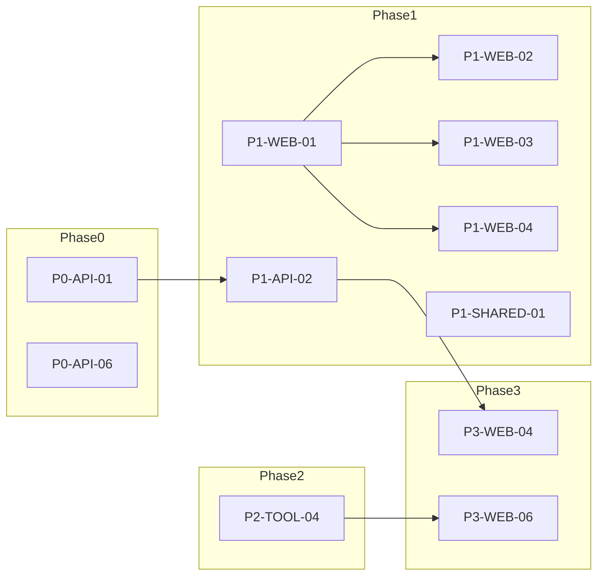

# Codebase hardening plans

This directory holds a **phase-split, actionable catalog** of improvements identified in the codebase review. Each phase file uses a shared issue template: severity, effort, affected files, current behavior, root cause, proposed fix, acceptance criteria, and rollout notes.

## How to use these documents

1. Start with [phase-0-hotfixes.md](phase-0-hotfixes.md) — correctness and security-adjacent fixes that should land before larger refactors.
2. Run [phase-1-architecture.md](phase-1-architecture.md) in parallel workstreams (API, web, shared contracts) where dependencies allow.
3. Layer [phase-2-tooling.md](phase-2-tooling.md) alongside Phase 1 once the repo has capacity for CI and lint churn.
4. Finish with [phase-3-polish.md](phase-3-polish.md) after streaming and server-state foundations exist where noted.

Track progress by updating `Status` in each issue block from `proposed` → `in-progress` → `done` (or `blocked` / `deferred` with a short reason).

## ID format

| Pattern | Meaning |
| --- | --- |
| `P0-*` | Hotfixes — ship first |
| `P1-*` | Architecture — larger structural change |
| `P2-*` | Tooling, CI, repo hygiene |
| `P3-*` | UX and small API cleanups |

Areas: `API` (FastAPI backend), `WEB` (TanStack Start app), `INFRA` (Docker/compose), `TOOL` (root tooling), `SHARED` (packages/shared).

## Status legend

| Status | Meaning |
| --- | --- |
| `proposed` | Not started |
| `in-progress` | Active work |
| `blocked` | Waiting on dependency or decision |
| `done` | Merged and verified |
| `deferred` | Explicitly postponed with rationale |

## Severity legend

| Severity | Meaning |
| --- | --- |
| `critical` | Security, data loss, or incorrect behavior under normal use |
| `high` | Reliability, performance at scale, or major maintainability debt |
| `medium` | DX, consistency, or moderate risk items |
| `low` | Polish and optional improvements |

## Effort legend

| Effort | Meaning |
| --- | --- |
| `S` | Up to ~0.5 day |
| `M` | ~1–2 days |
| `L` | ~3+ days |

## Semantic commit prefix mapping

| Phase | Preferred prefixes |
| --- | --- |
| P0 | `fix:` (or `chore:` for pure config moves) |
| P1 | `feat:`, `refactor:` |
| P2 | `chore:`, `ci:`, `docs:` |
| P3 | `feat:`, `fix:`, `docs:` |

## Master task list (43 IDs)

| ID | Summary | Phase file |
| --- | --- | --- |
| P0-API-01 | Share long-lived HTTP clients and caches across requests | [phase-0-hotfixes.md](phase-0-hotfixes.md) |
| P0-API-02 | Harden request body size limits (no Content-Length-only bypass) | [phase-0-hotfixes.md](phase-0-hotfixes.md) |
| P0-API-06 | Single database unit-of-work for chat turns | [phase-0-hotfixes.md](phase-0-hotfixes.md) |
| P0-WEB-01 | Move router devtools to devDependencies | [phase-0-hotfixes.md](phase-0-hotfixes.md) |
| P0-WEB-02 | Pin or document web toolchain versions | [phase-0-hotfixes.md](phase-0-hotfixes.md) |
| P0-INFRA-01 | Single source of truth for MinIO credentials in Compose | [phase-0-hotfixes.md](phase-0-hotfixes.md) |
| P1-API-01 | Decompose `ChatService.generate_response` | [phase-1-architecture.md](phase-1-architecture.md) |
| P1-API-02 | Expose streaming chat completion | [phase-1-architecture.md](phase-1-architecture.md) |
| P1-API-03 | Extend `/health` with Postgres and MinIO probes | [phase-1-architecture.md](phase-1-architecture.md) |
| P1-API-04 | Structured logging and request correlation | [phase-1-architecture.md](phase-1-architecture.md) |
| P1-API-05 | Tighten CORS allowlists | [phase-1-architecture.md](phase-1-architecture.md) |
| P1-API-06 | Reduce storage-guard COUNT churn and add shared test fixtures | [phase-1-architecture.md](phase-1-architecture.md) |
| P1-WEB-01 | Adopt TanStack Query for server state | [phase-1-architecture.md](phase-1-architecture.md) |
| P1-WEB-02 | Optimistic user message UI | [phase-1-architecture.md](phase-1-architecture.md) |
| P1-WEB-03 | Split `ChatPage` into focused hooks/components | [phase-1-architecture.md](phase-1-architecture.md) |
| P1-WEB-04 | Periodic health polling | [phase-1-architecture.md](phase-1-architecture.md) |
| P1-SHARED-01 | Generate shared TS types from OpenAPI | [phase-1-architecture.md](phase-1-architecture.md) |
| P2-TOOL-01 | Husky + lint-staged | [phase-2-tooling.md](phase-2-tooling.md) |
| P2-TOOL-02 | GitHub Actions CI | [phase-2-tooling.md](phase-2-tooling.md) |
| P2-TOOL-03 | Stricter TypeScript compiler options + root `tsconfig.base.json` | [phase-2-tooling.md](phase-2-tooling.md) |
| P2-TOOL-04 | ESLint hardening (type-aware, a11y, import, floating promises) | [phase-2-tooling.md](phase-2-tooling.md) |
| P2-TOOL-05 | Root Prettier config and format scripts | [phase-2-tooling.md](phase-2-tooling.md) |
| P2-TOOL-06 | TSDoc/JSDoc on exported public surfaces | [phase-2-tooling.md](phase-2-tooling.md) |
| P2-TOOL-07 | Split Compose dev vs prod | [phase-2-tooling.md](phase-2-tooling.md) |
| P2-TOOL-08 | DRY repeated Ollama model bootstrap services | [phase-2-tooling.md](phase-2-tooling.md) |
| P2-TOOL-09 | Harden `local-start.ts` (timeouts, detection) | [phase-2-tooling.md](phase-2-tooling.md) |
| P2-TOOL-10 | Git ignore local env files; document examples only | [phase-2-tooling.md](phase-2-tooling.md) |
| P2-TOOL-11 | ESLint coverage for `scripts/*.ts` | [phase-2-tooling.md](phase-2-tooling.md) |
| P2-TOOL-12 | Link this plan from root README | [phase-2-tooling.md](phase-2-tooling.md) |
| P3-WEB-01 | Composer keyboard shortcuts (Enter to send) | [phase-3-polish.md](phase-3-polish.md) |
| P3-WEB-02 | Dismissable error banner | [phase-3-polish.md](phase-3-polish.md) |
| P3-WEB-03 | Persist composer draft in sessionStorage | [phase-3-polish.md](phase-3-polish.md) |
| P3-WEB-04 | Streaming token indicator | [phase-3-polish.md](phase-3-polish.md) |
| P3-WEB-05 | Use shared defaults for crew template IDs | [phase-3-polish.md](phase-3-polish.md) |
| P3-WEB-06 | Enforce async patterns (ties to P2-TOOL-04) | [phase-3-polish.md](phase-3-polish.md) |
| P3-API-01 | Remove no-op orchestration response shaping | [phase-3-polish.md](phase-3-polish.md) |
| P3-API-02 | Simplify `_read_timestamp` for Python 3.12+ | [phase-3-polish.md](phase-3-polish.md) |
| P3-API-03 | Document and test `_select_completion_history` | [phase-3-polish.md](phase-3-polish.md) |

**Note:** The original review listed “storage guard COUNT reduction” and “shared pytest fixtures” as separate themes; this catalog merges them into **P1-API-06** so the master list stays at **43** IDs while preserving both acceptance tracks.

## Dependency matrix

| Task | Depends on |
| --- | --- |
| P1-API-02 | P0-API-01 (stable HTTP client for streams) |
| P1-WEB-02, P1-WEB-03, P1-WEB-04 | P1-WEB-01 (Query client in place) |
| P1-SHARED-01 | None hard; easiest after P1-API-02 if OpenAPI includes new routes |
| P3-WEB-04 | P1-API-02, P1-WEB-01 |
| P3-WEB-06 | P2-TOOL-04 (`no-floating-promises` and team agreement) |
| P0-INFRA-02 | P0-BRIDGE-01 (secret and header contract) |

## Rollout order

1. **Phase 0** — Land in small PRs; each should be independently revertible. Order within P0: P0-WEB-01 and P0-WEB-02 can merge anytime; P0-API-01 before heavy load testing; P0-BRIDGE-01 + P0-INFRA-02 together if adding auth.
2. **Phase 1** — After P0-API-06 (transactions), large chat refactors are safer. Backend streaming (P1-API-02) can start once P0-API-01 shares a client. Frontend Query adoption (P1-WEB-01) should precede optimistic UI and `ChatPage` splits.
3. **Phase 2** — Start once at least one green path exists on main; expect a “lint/format burst” PR after P2-TOOL-03–04.
4. **Phase 3** — After P1-API-02 + P1-WEB-01 for streaming UI and stable patterns.

## Related documentation

- [../architecture.md](../architecture.md) — stack overview
- [../../README.md](../../README.md) — add a “Hardening plans” bullet after P2-TOOL-12
